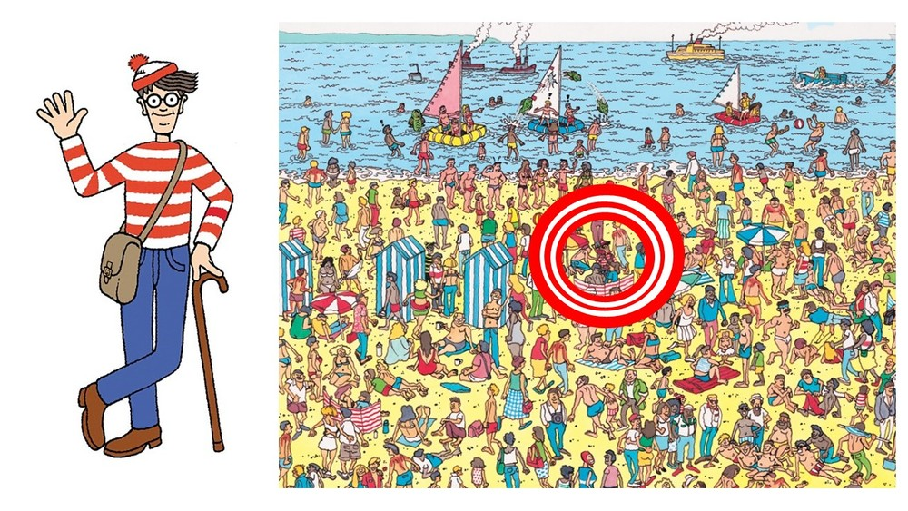
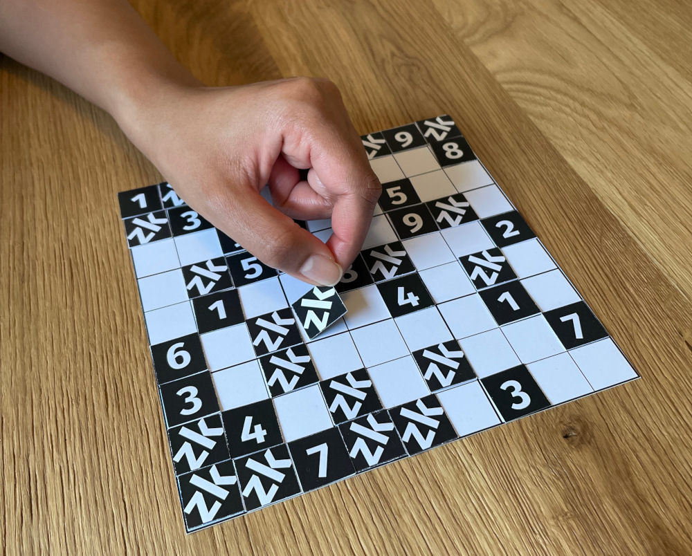
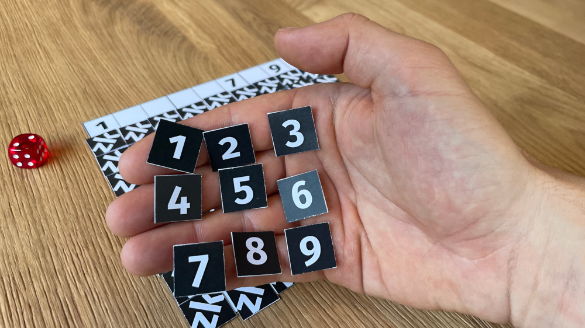
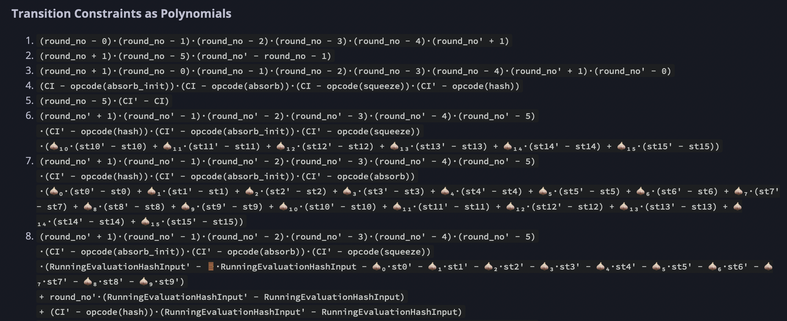

### Practical zk
### applications of
# Triton VM

Simon Shine
March 30, 2023

---

Slides available on:
https://github.com/sshine/triton-vm-slides

Feel free to interrupt with questions.

---

### About me

- 2021: Penneo
- 2022: [neptune.cash](https://neptune.cash): zk-STARKs
- 2023: [nerve smart systems.com](https://nervesmartsystems.com):
	High-power battery EV chargers

 

I've been 🦀'ing out for 16 months now

---

### Summary of talk

1. Zero-knowledge protocols (examples, uses)
2. Turning problems into polynomials (briefly)
3. Turning a set of VM instructions into equations
4. Zero-knowledge protocols (assembly edition)
5. Abusing the `syn` package: "Rust" on Triton VM

---

### Part 1:
#### Zero-knowledge protocols

---

Where's Wally?


---

zudoku.xyz by Ferdinand Sauer (CC-BY 4.0)


---

zudoku.xyz by Ferdinand Sauer (CC-BY 4.0)


---

zudoku.xyz by Ferdinand Sauer (CC-BY 4.0)


---

Questions so far?

---

When are zk protocols valuable for society?

They let us prove quantified
risk with privacy enabled.

---

Loan / insurance scoring without leaking...
- how much you earn
- when and what you buy
- when, where and how fast you go
- your heart rate, cholesterol, blood sugar

---

How do you translate this into computer problems?

Using polynomials.

---

### Part 2:
#### Turning problems into polynomials

---

Prove you know the millionth Fibonacci number
(without revealing the calculation or the number)

$\Updownarrow$

Prove you know a polynomial $P(x)$ that represents
the output of $Fib(x)$ at step $x$ of its execution
(without revealing $P(x)$ for $x$ from 1 to 1 million)

$$P(x) = \text{the } x \text{'th Fibonacci number}$$

...in fewer than 1 million steps!

---

A constraint checking polynomial $C(x)$:

$C(y) = 0$ when $P(x) = Fib(x)$

$\Downarrow$

Prove you know a polynomial $C(y)$ where
$C(P(x)) = 0$ for all $x$ from 1 to 1 million

---

How to express the constraint for $Fib(x)$?

$$
Fib(x) =
\begin{cases}
Fib(x-1) + Fib(x-2) & \text{if } x\geq 2 \\
1              & \text{if } x\geq 1 \\
0              & \text{if } x\geq 0 \\
\end{cases}
$$

---

$P(x+2) = P(x+1) + P(x)$

$\Updownarrow$

$P(x+2) - P(x+1) - P(x) = 0$

$\Updownarrow$

$C(P(x), P(x+1), P(x+2))$

$\Updownarrow$

$C_1(y_1,y_2,y_3) = y_3 - y_2 - y_1$

---

Let's invent some more polynomials:

$Z(x) = (x-1)·(x-2)·(x-3)·🧐·(x-1\text{ million})$

Clearly, $Z(x) = 0$ for all $x$ from 1 to 1 million.

$\Downarrow$

Prove you know polynomials $P(x)$ and $D(x)$ so

$C(P(x)) = Z(x)·D(x)$

(dividing a polynomial can happen with *long polynomial division*, or FFTs)

---

### Status

- $C(P(x)) = Z(x)·D(x)$
- Alice claims to have $C(P(1\text{ million}))$
- Bob knows $Z(x)$, their conviction needs $D(x)$.
- Bob gives Alice sample $x$'es.
- Alice gives Bob $D(x)$'es.
- Bob believes Alice with some probability.
- Repeat this process until the probability is astronomically likely.

---


...since we're 10% into the
math behind zk-STARKs.

---

### Part 3:
#### Turning a set of VM instructions into equations

---

- `nop`
	- $ci_t = opcodes[nop]$
	- $clk_t + 1 = clk_{t+1}$
	- $pc_t + 1 = pc_{t+1}$
- `add`
	- $stack[0]_{t+1} = stack[0]_t + stack[1]_t$
	- "is a binary operation"
	- "does not modify memory"
- `push` $n$
	- $stack[0]_{t+1} = n$
	- $stack[1]_{t+1} = stack[0]_t$

---



https://triton-vm.org/spec/arithmetization.html

---

### Part 4:
#### zk protocols (assembly edition)

---

### Prove $Fib(i)$

```
// Initialize stack: _ 0 1 i
main:
  push 0
  push 1
  divine

  call fib-loop
  write_io // After loop, this is 0
  write_io // After loop, this is Fib(i)
  halt

fib-loop:
  dup0 skiz call fib-step
  dup0 skiz recurse
  return

// Before: _ a b i
// After: _ b (a+b) (i-1)
fib-step:
  push -1
  add
  swap2
  dup1
  add
  swap1
  swap2
  return
```

---

### Prove valid sudoku

Made by Alexander Lemmens, Simon Shine

```
main:
  call initialize_primes
  call read_sudoku
  call initialize_flag
  call write_sudoku_and_check_rows
  call check_columns
  call check_squares
  push 0
  read_mem
  assert
  halt

// For mapping legal Sudoku digits to distinct primes. 
// Helps with checking consistency of rows, columns, and boxes. 

initialize_primes:
  push 1 push 2 write_mem pop
  push 2 push 3 write_mem pop
  push 3 push 5 write_mem pop
  push 4 push 7 write_mem pop
  push 5 push 11 write_mem pop
  push 6 push 13 write_mem pop
  push 7 push 17 write_mem pop
  push 8 push 19 write_mem pop
  push 9 push 23 write_mem pop
  return

read_sudoku:
  call read9
  call read9
  call read9
  call read9
  call read9
  call read9
  call read9
  call read9
  call read9
  return

read9:
  call read1
  call read1
  call read1
  call read1
  call read1
  call read1
  call read1
  call read1
  call read1
  return

// Applies the mapping from legal Sudoku digits to distinct primes.

read1: // _
  read_io // _ d
  read_mem // _ d p
  swap 1 // _ p d
  pop // _ p
  return

initialize_flag:
  push 0
  push 1
  write_mem
  pop
  return

// row0 row1 row2 row3 row4 row5 row6 row7 row8
write_sudoku_and_check_rows:
  push 9 // row0 row1 row2 row3 row4 row5 row6 row7 row8 9
  call write_and_check_one_row // row0 row1 row2 row3 row4 row5 row6 row7 
							   // 18
  call write_and_check_one_row // row0 row1 row2 row3 row4 row5 row6 27
  call write_and_check_one_row // row0 row1 row2 row3 row4 row5 36
  call write_and_check_one_row // row0 row1 row2 row3 row4 45
  call write_and_check_one_row // row0 row1 row2 row3 54
  call write_and_check_one_row // row0 row1 row2 63
  call write_and_check_one_row // row0 row1 72
  call write_and_check_one_row // row0 81
  call write_and_check_one_row // 90
  pop // ⊥
return

write_and_check_one_row: // s0 s1 s2 s3 s4 s5 s6 s7 s8 mem_addr
  push 1 // s0 s1 s2 s3 s4 s5 s6 s7 s8 mem_addr 1
  call multiply_and_write // s0 s1 s2 s3 s4 s5 s6 s7 (mem_addr+1) s8
  call multiply_and_write // s0 s1 s2 s3 s4 s5 s6 (mem_addr+2) (s8·s7)
  call multiply_and_write // s0 s1 s2 s3 s4 s5 (mem_addr+3) (s8·s7·s6)
  call multiply_and_write // s0 s1 s2 s3 s4 (mem_addr+4) (s8·s7·s6·s5)
  call multiply_and_write // s0 s1 s2 s3 (mem_addr+5) (s8·s7·s6·s5·s4)
  call multiply_and_write // s0 s1 s2 (mem_addr+6) (s8·s7·s6·s5·s4·s3)
  call multiply_and_write // s0 s1 (mem_addr+7) (s8·s7·s6·s5·s4·s3·s2)
  call multiply_and_write // s0 (mem_addr+8) (s8·s7·s6·s5·s4·s3·s2·s1)
  call multiply_and_write // (mem_addr+9) (s8·s7·s6·s5·s4·s3·s2·s1·s0)
  push 223092870 // (mem_addr+9) (s8·s7·s6·s5·s4·s3·s2·s1·s0) 223092870
  eq             // (mem_addr+9) (s8·s7·s6·s5·s4·s3·s2·s1·s0==223092870)
  skiz           // (mem_addr+9)
    return

  push 0    // (mem_addr+9) 0
  push 0    // (mem_addr+9) 0 0
  write_mem // (mem_addr+9) 0
  pop       // (mem_addr+9)
  return

  

multiply_and_write: // s mem_addr acc
  dup 2     // s mem_addr acc s
  mul       // s mem_addr (acc·s)
  swap 1    // s (acc·s) mem_addr
  push 1    // s (acc·s) mem_addr 1
  add       // s (acc·s) (mem_addr+1)
  swap 1    // s (mem_addr+1) (acc·s)
  swap 2    // (acc·s) (mem_addr+1) s
  write_mem // (acc·s) (mem_addr+1)
  swap 1    // (mem_addr+1) (acc·s)
  return

check_columns:
  push 1
  call check_one_column
  push 2
  call check_one_column
  push 3
  call check_one_column
  push 4
  call check_one_column
  push 5
  call check_one_column
  push 6
  call check_one_column
  push 7
  call check_one_column
  push 8
  call check_one_column
  push 9
  call check_one_column
  return

  

check_one_column:
  call get_column_element
  call get_column_element
  call get_column_element
  call get_column_element
  call get_column_element
  call get_column_element
  call get_column_element
  call get_column_element
  call get_column_element
  pop
  call check_9_numbers
  return

  

get_column_element:
  push 9
  add
  read_mem
  swap 1
  return

check_squares:
  push 10
  call check_one_square
  push 13
  call check_one_square
  push 16
  call check_one_square
  push 37
  call check_one_square
  push 40
  call check_one_square
  push 43
  call check_one_square
  push 64
  call check_one_square
  push 67
  call check_one_square
  push 70
  call check_one_square
  return

check_one_square:
  read_mem
  swap 1
  push 1
  add
  read_mem
  swap 1
  push 1
  add
  read_mem
  swap 1
  push 7
  add
  read_mem
  swap 1
  push 1
  add
  read_mem
  swap 1
  push 1
  add
  read_mem
  swap 1
  push 7
  add
  read_mem
  swap 1
  push 1
  add
  read_mem
  swap 1
  push 1
  add
  read_mem
  swap 1
  pop
  call check_9_numbers
  return

check_9_numbers:
  mul
  mul
  mul
  mul
  mul
  mul
  mul
  mul // 223092870 = 2·3·5·7·11·13·17·19·23
  push 223092870
  eq
  skiz
    return
  push 0
  push 0
  write_mem
  pop
  return
```

---

### Learn more

Vitalik Buterin's tutorial part 1:
- https://vitalik.ca/general/2017/11/09/starks_part_1.html

Alan Szepieniec's tutorials:
- https://aszepieniec.github.io/stark-anatomy/
- https://aszepieniec.github.io/stark-brainfuck/

Ferdinand Sauer's talk: How to build a zk-VM
- https://www.youtube.com/watch?v=Nz4OYntBVMg

Andrew Milson's miniSTARK:
- https://github.com/andrewmilson/ministark
